# Decompiling

This document describes the basics how to start decompiling code and contributing to this decompilation project, as well as explaining some common pitfalls. Feel free to ask for help in the ZeldaRET Discord server if you get stuck or need assistance.

If you haven't already, you should first follow the instructions in the [readme](../README.md) to get the decomp set up, as well as the tools you will be using to work on it: objdiff and Ghidra.

## Table of Contents

1. [Choosing an object to decompile](#choosing-an-object-to-decompile)
2. [Setting up classes/structs](#setting-up-classesstructs)
3. [Decompiling functions](#decompiling-functions)
4. [Inline functions and how to read the debug maps](#inline-functions-and-how-to-read-the-debug-maps)
5. [Recognizing switch statements](#recognizing-switch-statements)
6. [Fixing minor nonmatching issues](#fixing-minor-nonmatching-issues)
7. [Linking a 100% matching object](#linking-a-100-matching-object)
8. [Documentation and naming](#documentation-and-naming)

## Choosing an object to decompile

Once you have everything set up, you should pick which object (also called a translation unit, TU) you want to work on.

It's recommended to begin with a small and simple actor to learn the basics of decompilation. We have a list of small actors that haven't been decompiled yet [here on GitHub](https://github.com/zeldaret/tww/issues?q=is%3Aissue%20state%3Aopen%20label%3A%22easy%20object%22), so you can pick one of those. You can leave a comment on the issue saying that you're working on it to let others know that they shouldn't pick the same one.

Now that you've decided on an object, open up objdiff and type the object's name (e.g. `d_a_wall`) into the filter bar on the left, then click on it to open it. You should see a list of data and functions in this TU.

You'll also want to open the source file for this TU in VSCode. You can do this by pressing VSCode's `Ctrl+P` shortcut and typing the name of the TU with the .cpp extension (e.g. `d_a_wall.cpp`).

## Setting up classes/structs

Once you've chosen which object you want to decompile, you'll usually want to set up the actor's class/struct in Ghidra before you start decompiling any code.

> [!NOTE]
> Some actors that aren't decompiled may have already had their struct defined in our Ghidra server by someone else in the past, in which case you may be able to skip this step. But this is not the case for most actors.

In objdiff, pick one of the actor's functions (one with "create" in the name would be good to start with). Then open the `main` program in Ghidra, press `G` and type the function name (e.g. `daWall_c::CreateInit`) to go to that function in Ghidra. If the struct hasn't been properly defined for Ghidra, the function may look something like this at first:

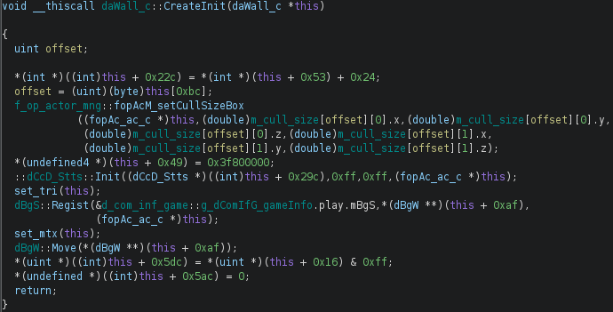

It's not very readable at the moment, so let's improve that. Right click the first parameter (e.g. `daWall_c *this`) and choose "Edit Data Type" to open Ghidra's structure editor:

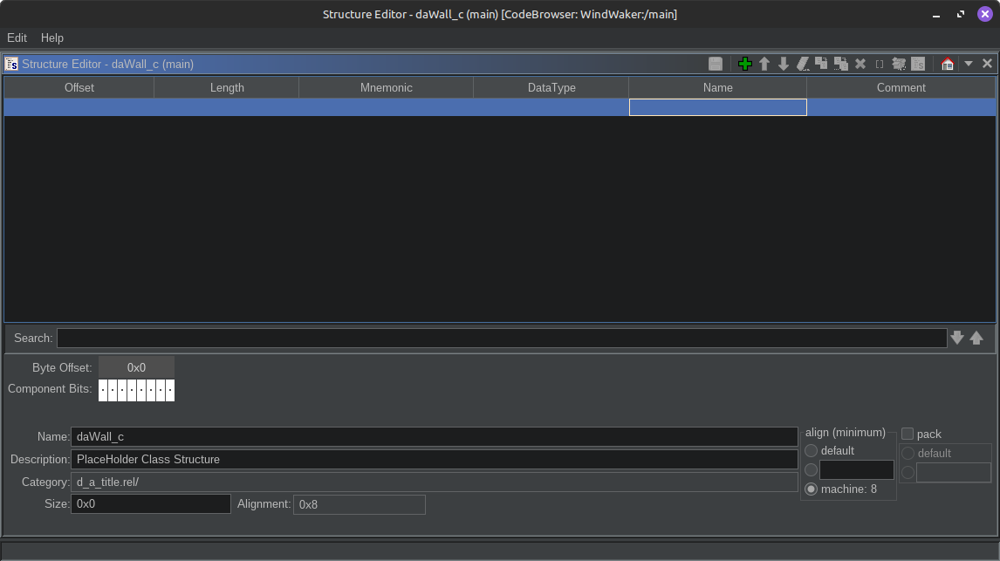

The placeholder struct defaults to empty, which is why Ghidra isn't doing a great job of decompiling the function. Let's give it the correct size. Luckily, all actors have a profile that tells us how large each instance should be.

Press `Ctrl+P` in VSCode and type the name of the TU with the .s extension (e.g. `d_a_wall.s`) to open the automatically generated assembly file. Then search for the text `g_profile` in this file to find the actor's profile near the bottom:

```asm
# .data:0xE4 | 0xE4 | size: 0x30
.obj g_profile_WALL, global
	.4byte 0xFFFFFFFD
	.4byte 0x0007FFFD
	.4byte 0x01B10000
	.4byte g_fpcLf_Method
	.4byte 0x000005E4
	.4byte 0x00000000
	.4byte 0x00000000
	.4byte g_fopAc_Method
	.4byte 0x01980000
	.4byte daWallMethodTable
	.4byte 0x00040100
	.4byte 0x000E0000
.endobj g_profile_WALL
```

The fifth line of the profile is the size, so 0x5E4 bytes in this example. Copy paste that number into the Size field of the struct editor you have open in Ghidra.

> [!NOTE]
> If the .s file doesn't exist, then you may need to run `ninja` to build the decomp for the first time. The decomp repo doesn't come with any assembly, it is generated from your own copy of TWW.

Next, you want to set the parent class of this actor to the actor base class. Change the data type of the first field from `undefined` to `fopAc_ac_c` and change its name from being blank to `parent`. It should look like this now:

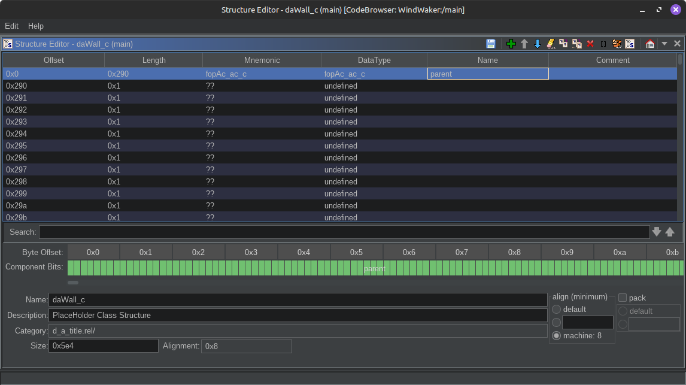

> [!NOTE]
> Some actors inherit from a different base class besides `fopAc_ac_c`. The most common are `dBgS_MoveBgActor` (for things like moving platforms), `fopNpc_npc_c` (for NPCs), or `fopEn_enemy_c` (for enemies). If you see one of those names show up in objdiff, your actor might inherit from that class.

Save the struct. If you go back to the function in Ghidra you were looking at before, it should be somewhat more readable now:

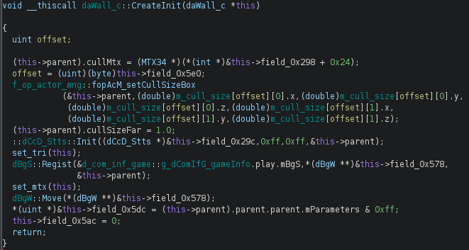

But we can still improve it further by defining this actor's own fields too. You see the part where it says `*(uint *)&this->field_0x5dc`? That pointer cast before a field name (`*(Type *)&`) is Ghidra trying to tell you that the field at offset 0x5dc hasn't had its type correctly defined.  
Right click on the `field_0x5dc` part, choose "Retype Field", and replace `undefined` with `uint` (or whatever the type is in your case). If you did it properly, it should now show as just `this->field845_0x5dc` without the `*(uint *)&` part.  
Repeat this process for the other fields that are referenced in this function. For example, `*(dBgW **)&this->field_0x578` means that `field_0x578` should be retyped as `dBgW *`.  

Once you've properly typed everything in this function, it should look a lot cleaner than it did originally:

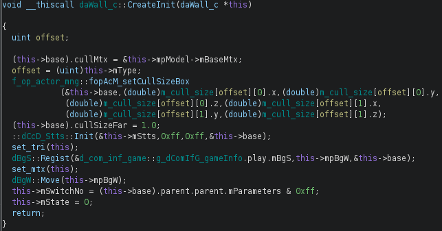

(In the above screenshot, the fields have also been renamed, but you don't have to do that if you're not sure what they are. No names are less confusing than incorrect names, and they can always be named in a documentation pass later on.)

Once you're done with one function, go through all of this actor's other functions, and continue retyping all of this actor's fields. Starting with constructors and functions that have "create" or "init" or "heap" in their name will make it easier.

After all of the actor's fields have proper types, it's almost time to actually start decompiling. The only thing left to do is get all these fields you defined into the decomp itself.  
Open up the header file for the actor you're working on (e.g. `d_a_wall.h`).  You should see a placeholder that says `/* Place member variables here */` inside the actor's class definition.  
You could start manually typing out all of the fields in there, but that would be a waste of time if you already defined them in Ghidra. Instead, you can use a Ghidra script we have to automate the process.  

In Ghidra, select Window -> Script Manager -> Create New Script -> Python. Name the script `tww_class_to_cpp.py`, and copy paste the contents of [this file](tww_class_to_cpp.py) into the new script. You can optionally assign a keyboard shortcut if you wish (e.g. `Alt+Shift+S`).  
You will be prompted to type the name of struct you want to export. After clicking Okay, all of the struct's members will now be automatically copied onto your clipboard.  
Simply replace the `/* Place member variables here */` line in the header by pasting over it.  

Great, now the actor's class is fully defined in both Ghidra and the decomp! Now you can start actually decompiling some functions.

## Decompiling functions

With your TU open in objdiff, you should select a small function to start with. Here's what a small function will look like when you click it in objdiff:

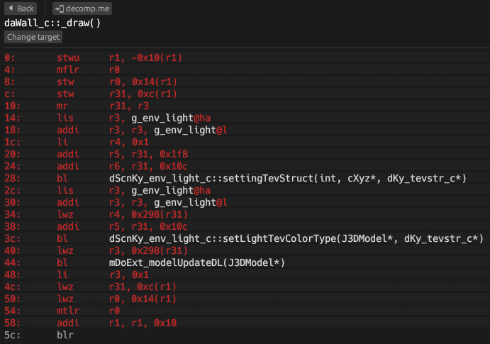

In VSCode, find the placeholder for the function you're going to be working on, which should currently be empty:

```cpp
/* 00000FE4-00001044       .text _draw__8daWall_cFv */
void daWall_c::_draw() {
    /* Nonmatching */
}
```

Navigate to this function in Ghidra. You might see something like this:

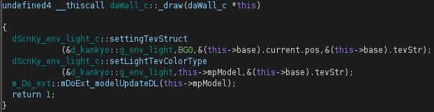

Ghidra's pseudocode isn't accurate enough to be directly copy-pasted into this decompilation project, but it's still useful for quickly understanding what most functions are doing.

In this example, the function would look like this when fully decompiled (don't remove the "Nonmatching" comment until it shows 100% matching in objdiff!):

```cpp
/* 00000FE4-00001044       .text _draw__8daWall_cFv */
bool daWall_c::_draw() {
    g_env_light.settingTevStruct(TEV_TYPE_BG0, &current.pos, &tevStr);
    g_env_light.setLightTevColorType(mpModel, &tevStr);
    mDoExt_modelUpdateDL(mpModel);
    return true;
}
```

There are several minor differences between what Ghidra showed us and how the function should actually be written. Things like passing objects as the first argument to their functions, unnecessarily using `this->`, or writing out `(Type *)0x0` instead of `NULL` are Ghidra-isms that you'll start to pick up on over time.  
The easiest way to learn about these differences is to look for similar code in already-decompiled actors. In VSCode, you can press `Ctrl+Shift+F` and type the name of a function to search for everywhere in the decomp that function was used, which should help you understand how it will be called.  

But despite the minor syntax differences, the above example looks pretty similar in both Ghidra and the decomp. Not all functions will look this similar.

For example, if you were to look at the actor's create function, you should see something like this at the top of the function in Ghidra:

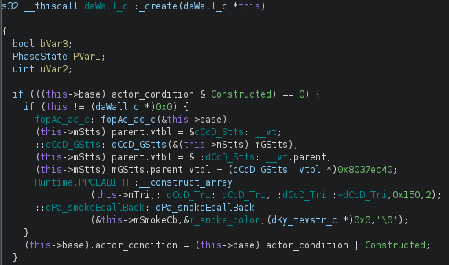

This code is constructing the actor when it's first created. You shouldn't write it out by hand - instead, use the `fopAcM_SetupActor` macro, like so:

```cpp
    fopAcM_SetupActor(this, daWall_c);
```

That should expand out into the proper code when compiled. If something in there is missing even after using the macro, then you might not have set up all of the actor's member variables properly in the previous step, so add any missing fields now.

There are other macros to watch out for too. A common pattern you'll likely see at some point is a debug assertion, which looks like this in Ghidra:

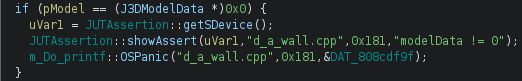

The macro to use in this case is `JUT_ASSERT`, which handles checking a condition and showing that condition as a string:

```cpp
    JUT_ASSERT(0x181, modelData != NULL);
```

Note that any variables used in a debug assertion must have their names match the assertion string exactly, like the `modelData` local variable in this case. This can sometimes even give you the official name of a member variable. Defines like `NULL` or `FALSE` work a bit differently and show up as their value (e.g. `0`) in the assertion strings, instead of appearing the way the programmer actually wrote them.

Other than those two macros, there's another common case that can cause code to look very different in Ghidra compared to how it was originally written: **inline functions**. These are used all over the place in TWW's codebase, and they're important to get right for several reasons, but as there are thousands of them we can't go over all of them individually in this guide. Instead, let's go over what the workflow for finding them on your own will look like.

## Inline functions and how to read the debug maps

Inline functions, or inlines for short, are functions that don't show up in Ghidra's decompiled code or objdiff's disassembly. This is because, while the original programmers wrote a function call, the compiler replaced that call with the *contents* of the inline function as an optimization. Inlines are generally pretty small functions, most often only a single line long.

When decompiling, you should try to use the same inlines the original devs used whenever possible, not only because this makes the code much more readable, but also because inline usage affects how the compiler generates code in many non-obvious ways.  

If you've fully decompiled a function and are sure you didn't make any mistakes, but the function doesn't match in objdiff due to some small issue in the assembly, it's possible that you need to use the same inlines that the original developers used in order to get the compiler to generate the same assembly.

Some examples of small issues in the assembly that may be caused by incorrect inline usage:
* Two or more registers being swapped around (regswap/regalloc)
* Instructions being slightly out of order
* Instructions being unnecessarily duplicated (on either the left or right hand side)

But how can you know which inlines to use if they're not in the assembly? Inlines do appear in debug builds, but we don't have access to a debug binary of TWW like TP.  
But luckily, we do have access to debug *symbol maps* for a Japanese prerelease kiosk demo of TWW. This demo is from very late in TWW's development, so the debug maps have the names of almost every single inline the final retail game uses.

Without the accompanying debug binary, there is some guesswork involved in figuring out exactly where each inline is used, but we'll cover some examples of how to read these maps and determine what inlines to use where.

First of all, download all the debug maps. You can find them pinned in the [tww-decomp](https://discord.com/channels/688807550715560050/1150077060098822226) channel of the ZeldaRET Discord server.

Second, open up the debug map for the actor you're working on. For example, if your object is called `d_a_wall`, you would open up `d_a_wallD.map`. Then consult the [Reading REL debug maps](#reading-rel-debug-maps) section below.  
If the actor you're working on *doesn't* have its own `D.map` file, then it was probably merged in with `frameworkD.map`, which makes it harder to read. In this case, consult the [Reading frameworkD.map](#reading-frameworkdmap) section below.

### Reading REL debug maps

Let's take a look at another unmatched function in our TU:

```cpp
/* 00000F74-00000FE4       .text set_se__8daWall_cFv */
void daWall_c::set_se() {
    /* Nonmatching */
}
```

In Ghidra, the function looks like this:

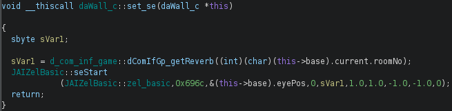

You might be tempted to clean up Ghidra's output and decompile the function like this:

```cpp
/* 00000F74-00000FE4       .text set_se__8daWall_cFv */
void daWall_c::set_se() {
    JAIZelBasic::zel_basic->seStart(0x696C, &eyePos, 0, dComIfGp_getReverb(current.roomNo), 1.0f, 1.0f, -1.0f, -1.0f, 0);
}
```

That does match in this case (it won't always), but we can improve it by checking this function in the debug map for this actor. Copy paste the function's *mangled* name (the last part of the comment after .text, e.g. `set_se__8daWall_cFv`) and `Ctrl+F` for it in the `D.map` for your actor.  
You should see something along these lines:

```
         8] set_se__8daWall_cFv (func,global) found in d_a_wall.o 
          9] fopAcM_seStart__FP10fopAc_ac_cUlUl (func,weak) found in d_a_wall.o 
>>> SYMBOL NOT FOUND: dComIfGp_getReverb__Fi
           10] mDoAud_seStart__FUlP3VecUlSc (func,weak) found in d_a_wall.o 
            11] getInterface__11JAIZelBasicFv (func,weak) found in d_a_wall.o 
>>> SYMBOL NOT FOUND: zel_basic__11JAIZelBasic
>>> SYMBOL NOT FOUND: seStart__11JAIZelBasicFUlP3VecUlScffffUc
         8] dComIfG_Ccsp__Fv (func,weak) found in d_a_wall.o 
```

This is part of the *linker tree*, which shows which functions call other functions. It also tells us which functions are inlines - the ones with `(func,weak)` after their name.  
The number on the left hand side indicates the indentation/depth in the tree. So `set_se` is at depth 8, and `fopAcM_seStart` is at depth 9. That means `set_se` calls `fopAcM_seStart`, which has `(func,weak)` so it's an inline. `mDoAud_seStart` is also an inline, but it's at depth 10, meaning it's called by `fopAcM_seStart`, not by `set_se` directly.
There are no other functions below `set_se` in the tree at depth 9, so it only calls that one inline.  

> [!NOTE]
> The symbol names in the debug maps are mangled, like `fopAcM_seStart__FP10fopAc_ac_cUlUl`. If you need to read one of these more clearly, you can use objdiff's Tools -> Demangle... to get the demangled form of the symbol, such as `fopAcM_seStart(fopAc_ac_c*, unsigned long, unsigned long)`.

Let's try decompiling this function again, but this time using the `fopAcM_seStart` inline:

```cpp
/* 00000F74-00000FE4       .text set_se__8daWall_cFv */
void daWall_c::set_se() {
    fopAcM_seStart(this, JA_SE_OBJ_BOMB_WALL_BRK, 0);
}
```

This is much closer to how it would have looked when written by the original devs.  
(The `JA_SE` value there is part of an enum of sound effects - if you search through the decomp for decompiled actors that call `fopAcM_seStart`, you will see this enum being used when that inline is called.)  

However, there's an important caveat to keep in mind when reading the debug maps: Each inline only appears **once per map**, even if it was called multiple times.  
We got lucky in this example, because `fopAcM_seStart` was only called once in the entire file. But if it had been called multiple times and it already appeared higher up in the tree, nothing would have appeared underneath `set_se` when we had looked at it.  

To avoid this, you could start at the top of the linker tree (search for this text: `1] g_profile_`) and decompile functions in the order they appear there, which is a different order from how they appear in the .cpp file.  
But with experience you'll start to recognize more inlines even in cases where the debug maps don't help you for a particular function.

### Reading frameworkD.map

Sometimes, the actor you're working on doesn't have its own debug map. In these cases, the actor's symbols - and any inlines it uses - were merged into frameworkD.map with many other TUs instead. (This is more advanced, so if this doesn't apply to the object you're working on, you can skip this section.)

Inlines in frameworkD.map are harder to spot and understand, as this map doesn't have the linker tree described above like all other maps. It has a flat list of symbols instead, and while this list does include inlines, the order they're placed in is more confusing. Worse, the rule of inlines appearing only "once per map" mentioned above still applies here, but it's much more disruptive in this case due to this map having hundreds of TUs in it instead of just one.

To find the object you're working on, search for the TU name with the .o extension. For example, for the `d_a_player` TU:

```
  001e5028 0004d0 801ea768  1 .text 	d_a_player.o 
  001e5028 000078 801ea768  4 changePlayer__9daPy_py_cFP10fopAc_ac_c 	d_a_player.o 
  001e50a0 0001b0 801ea7e0  4 objWindHitCheck__9daPy_py_cFP8dCcD_Cyl 	d_a_player.o 
  001e5250 000038 801ea990  4 execute__25daPy_mtxFollowEcallBack_cFP14JPABaseEmitter 	d_a_player.o 
  001e5288 000058 801ea9c8  4 end__25daPy_mtxFollowEcallBack_cFv 	d_a_player.o 
  001e52e0 000080 801eaa20  4 makeEmitter__25daPy_mtxFollowEcallBack_cFUsPA4_fPC4cXyzPC4cXyz 	d_a_player.o 
  001e5360 000084 801eaaa0  4 makeEmitterColor__25daPy_mtxFollowEcallBack_cFUsPA4_fPC4cXyzPC8_GXColorPC8_GXColor 	d_a_player.o 
  001e53e4 000094 801eab24  4 setDoButtonQuake__9daPy_py_cFv 	d_a_player.o 
  001e5478 000080 801eabb8  4 stopDoButtonQuake__9daPy_py_cFi 	d_a_player.o 
  001e54f8 0001c8 801eac38  1 .text 	d_a_player.o 
  001e54f8 000024 801eac38  4 dComIfGp_att_ChangeOwner__Fv 	d_a_player.o 
  001e551c 00003c 801eac5c  4 dComIfGp_setPlayer__FiP10fopAc_ac_c 	d_a_player.o 
  001e5558 000010 801eac98  4 setPlayer__14dComIfG_play_cFiP10fopAc_ac_c 	d_a_player.o 
  001e5568 000040 801eaca8  1 .text 	d_a_player.o 
  001e5568 00002c 801eaca8  4 changeOwner__12dAttention_cFv 	d_a_player.o 
  001e5594 000008 801eacd4  1 .text 	d_a_player.o 
  001e5594 000008 801eacd4  4 Owner__9dCamera_cFP10fopAc_ac_c 	d_a_player.o 
```

This TU has multiple .text sections. When this happens, generally the first .text section will have the non-weak functions (the ones in `d_a_player.cpp`), while the rest of the .text sections will have inlines. Let's look at the inlines in the second .text section:

```
  001e54f8 0001c8 801eac38  1 .text 	d_a_player.o 
  001e54f8 000024 801eac38  4 dComIfGp_att_ChangeOwner__Fv 	d_a_player.o 
  001e551c 00003c 801eac5c  4 dComIfGp_setPlayer__FiP10fopAc_ac_c 	d_a_player.o 
  001e5558 000010 801eac98  4 setPlayer__14dComIfG_play_cFiP10fopAc_ac_c 	d_a_player.o 
```

This tells use that the inlines `dComIfGp_att_ChangeOwner()`, `dComIfGp_setPlayer(int, fopAc_ac_c*)`, and `dComIfG_play_c::setPlayer(int, fopAc_ac_c*)` are used in the `d_a_player` TU.  
It also tells us that these three inlines are not used by any of the other TUs that appear above this point in frameworkD.map.  
It doesn't tell us whether or not they're used by other TUs below this point, or vice versa. The `dComIfGp_getCamera` inline is used in this TU, and should appear in this section, but doesn't due to the "once per map" rule as it already appeared higher up in frameworkD.map for a different TU.

Unfortunately, it also doesn't tell us which specific function(s) in `d_a_player` call these inlines, because they're in a different section from d_a_player's own functions. However, it does give us a hint as to the *order* these functions are called in the TU.

Specifically, inlines at the same depth/indentation as each other in the linker tree will appear in **reverse order** in the list of symbols. But inlines at a lower depth will still appear below the inline that called them. Based on the names, `setPlayer` is *probably* a deeper inline that is called by `dComIfGp_setPlayer`. So if we were to take a guess and try to recreate the linker tree in this case, it might look something like this:

```
1] dComIfGp_setPlayer__FiP10fopAc_ac_c
 2] setPlayer__14dComIfG_play_cFiP10fopAc_ac_c
1] dComIfGp_att_ChangeOwner__Fv
```

This doesn't tell us as much as the real linker trees, and is based on guesswork, but going through this process can sometimes help you to determine what inlines you should be using where.

## Recognizing switch statements

The way that switch statements get compiled into assembly is not always obvious, and you usually can't rely on Ghidra to decompile them properly either. So we'll go over some things to watch out for that can indicate when a switch should be used.

The compiler can choose to compile a switch statement in two possible ways: As a tree of comparisons, or as a jump table.

We'll go over how to recognize what each of these types of switches looks like in both Ghidra and objdiff/assembly. We'll also cover how to use m2c to help decompile them, as m2c handles switches better than Ghidra.

### Comparison tree switches

The most common way for a switch to be compiled is as a tree of comparisons: `cmpwi`, `beq`, `bge`, `cmpwi`, etc, eventually ending in `b`, and then followed by the case blocks. Here's what an example with seven cases looks like in objdiff:

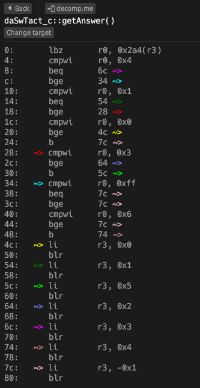

The comparison tree starts at offset 4 in this function and ends at offset 48. The first case block starts at offset 4c, the second at offset 54, etc.

Be aware that Ghidra does not handle this type of switch statement very well. It sees the comparisons and assumes they are if/else statements instead of a switch. If you only looked at Ghidra, you probably wouldn't be able to tell this was a switch at all, and would be tempted to write it with if statements instead (which will not match):

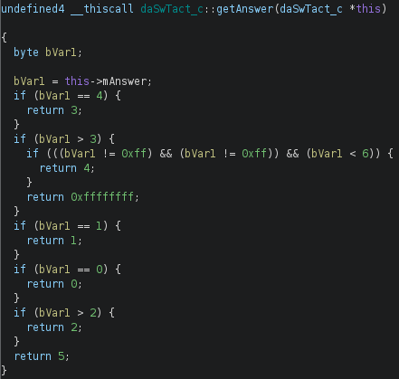

Furthermore, note that Ghidra almost always displays the case blocks in the wrong order for this type of switch statement.  
In this example, the return values in Ghidra are ordered like so: 3, 4, -1, 1, 0, 2, 5. The assembly in objdiff shows them as 0, 1, 5, 2, 3, 4, -1. You need to write the cases in the order shown by objdiff, not the order shown by Ghidra.

But decompiling switch statements with just Ghidra and objdiff can be difficult not only because Ghidra shows case blocks in the wrong order, but also because neither Ghidra nor objdiff show all of the case constants needed for the switch.  
For example, the `return 4;` case block in the above function is reached only when `mAnswer` is equal to `5`, so you need to write `case 5:`. But the constant 5 is not shown anywhere in either Ghidra or objdiff, as the compiler optimized it into the tree as a comparison against 4 and a comparison against 6 instead.

But there's another decompiler you can use instead of Ghidra that handles switch statements better: [m2c](https://github.com/matt-kempster/m2c).

To decompile a switch with m2c, first open the `.s` assembly file for your TU. Then find the function that has the switch in it and copy the whole thing to your clipboard, starting with the `.fn` line and ending with the `.endfn` line for that function.

Next go to [this online version of m2c](https://simonsoftware.se/other/m2c.html) and paste the contents of your function into the assembly field. Switch the "Target arch, compiler, & language:" field to "PPC, MWCC, C++" and hit decompile.

m2c should give you output similar to this:
```c++
s32 getAnswer__10daSwTact_cFv(daSwTact_c *this) {
    u8 temp_r0;

    temp_r0 = this->unk2A4;
    switch ((s32) temp_r0) {                        /* irregular */
    case 0x0:
        return 0;
    case 0x1:
        return 1;
    case 0x2:
        return 5;
    case 0x3:
        return 2;
    case 0x4:
        return 3;
    case 0x5:
        return 4;
    default:
        return -1;
    }
}
```

m2c isn't aware of field names/types defined in Ghidra or the decomp, but other than that, its output is pretty close. For comparison, here is the same function when fully decompiled and matching:

```c++
/* 0000038C-00000410       .text getAnswer__10daSwTact_cFv */
s32 daSwTact_c::getAnswer() {
    switch (mAnswer) {
    case 0:
        return 0;
    case 1:
        return 1;
    case 2:
        return 5;
    case 3:
        return 2;
    case 4:
        return 3;
    case 5:
        return 4;
    case 0xFF:
    default:
        return -1;
    }
}
```

One important detail in the above example is the `case 0xFF:`. Because this case leads to the same block as the default case, it has no functional effect on what the code does, and so m2c does not include it. However, if you don't include that useless case, the comparison tree will be missing some parts and the function will not match:

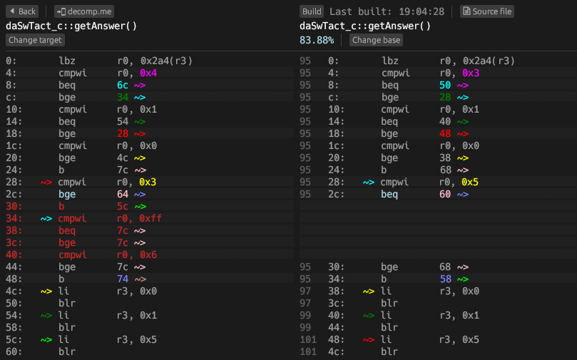

If you run into a situation like this, try looking through values that are compared against in objdiff or Ghidra and adding them as cases above `default:` (or if no default label exists, just make them immediately `break;` without doing anything). Sometimes the value you need to add as a case will be plus or minus one compared to the actual value being compared against, so it may take some trial and error to find which specific cases are required to get the tree to generate correctly.

Also note that occasionally, you may run into a very small switch statement that only has a single case label (optionally plus the default label). In these cases, there will be no `bge` in the assembly, just `cmpwi`, `beq`, `b`. For example:

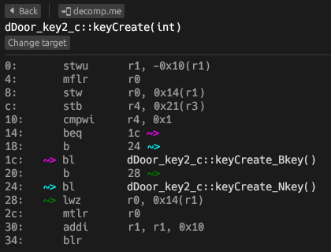

Both Ghidra *and* m2c will decompile these as if statements, but if you try writing them like that you'll see that the code doesn't match as the compiler produces `cmpwi`, `bne` with no `beq` or `b`. Here is how the small switch above should be decompiled to match:

```c++
/* 8006C910-8006C948       .text keyCreate__12dDoor_key2_cFi */
BOOL dDoor_key2_c::keyCreate(int type) {
    mbIsBossDoor = type;
    switch (type) {
    case 1: return keyCreate_Bkey();
    default: return keyCreate_Nkey();
    }
}
```

### Jump table switches

The other way the compiler may choose to compile a switch statement is as a jump table: `lis`, `addi`, `slwi`, `lwzx`, `mtcr`, `bctr`.  
This type of switch first loads a table located in the .data section (`lis`, `addi`), indexes into it with a variable (`slwi`, `lwzx`), and then jumps to the address read from the table (`mtcr`, `bctr`).

Unlike comparison tree switches, Ghidra is able to correctly recognize jump table switches as being switches, and will show them as such. For example:

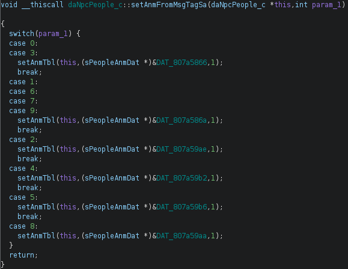

However, Ghidra still has the issue where it will show the case blocks out of order for this type of switch as well sometimes. The last 4 cases in the above example are not in the correct order and won't match when written like that.

You could write them in Ghidra's wrong order and then shuffle them around until they match in objdiff.  
However, note that even if a function shows 100% matching in objdiff, it's possible that the contents of the jump table could still be wrong. You would need to look at the .data section in objdiff, as the mismatch won't be shown within the function itself in this situation.

Alternatively, we can use m2c for this type of switch statement as well, and it will decompile the cases in the proper order.  
The process for decompiling jump table switches with m2c is similar to comparison tree switches, but there's an extra step required for m2c to find the jump table.

First open the assembly file and copy paste the function containing the switch into [m2c](https://simonsoftware.se/other/m2c.html) as mentioned earlier.  
Next, find where the assembly loads the jump table. It will look something like `lis r5, "@7298"@ha` followed by `addi r5, r5, "@7298"@l`, but the number after the `@` will be different. `Ctrl+F` for that `@` + number in the assembly file to find the contents of the jump table. It will look similar to this:

```asm
.obj "@7298", local
	.rel setAnmFromMsgTagSa__13daNpcPeople_cFi, .L_00007A48
	.rel setAnmFromMsgTagSa__13daNpcPeople_cFi, .L_00007A58
	.rel setAnmFromMsgTagSa__13daNpcPeople_cFi, .L_00007A78
	.rel setAnmFromMsgTagSa__13daNpcPeople_cFi, .L_00007A48
	.rel setAnmFromMsgTagSa__13daNpcPeople_cFi, .L_00007A88
	.rel setAnmFromMsgTagSa__13daNpcPeople_cFi, .L_00007A98
	.rel setAnmFromMsgTagSa__13daNpcPeople_cFi, .L_00007A58
	.rel setAnmFromMsgTagSa__13daNpcPeople_cFi, .L_00007A58
	.rel setAnmFromMsgTagSa__13daNpcPeople_cFi, .L_00007A68
	.rel setAnmFromMsgTagSa__13daNpcPeople_cFi, .L_00007A58
.endobj "@7298"
```

Copy the table, and paste it at the top of "Assembly" field in m2c (above the function itself). Then, replace the compiler-generated name (e.g. `@7298`) with the name `jtbl` (both the ones inside the function and the one before the jump table itself).  
Finally, add a new line `.section .data` before the jump table, as well as a new line `.section .text` after the table, before the function. It will look like this:

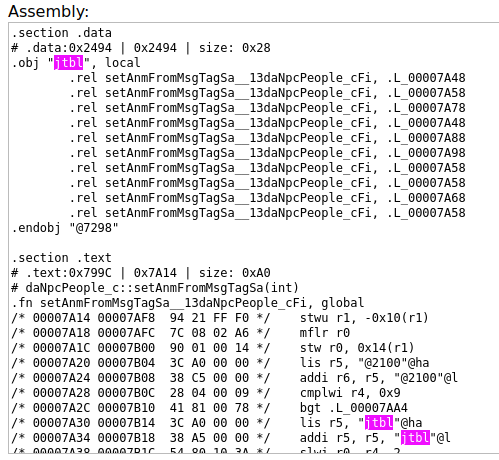

Now you can click "Decompile" and m2c will decompile the switch statement with its cases in the proper order, like this:

```cpp
void setAnmFromMsgTagSa__13daNpcPeople_cFi(daNpcPeople_c *this, u32 arg0) {
    switch (arg0) {
    case 0:
    case 3:
        setAnmTbl__13daNpcPeople_cFP13sPeopleAnmDati(this, &@2100 + 0x490, 1);
        return;
    case 1:
    case 6:
    case 7:
    case 9:
        setAnmTbl__13daNpcPeople_cFP13sPeopleAnmDati(this, &@2100 + 0x494, 1);
        return;
    case 8:
        setAnmTbl__13daNpcPeople_cFP13sPeopleAnmDati(this, &@2100 + 0x5D4, 1);
        return;
    case 2:
        setAnmTbl__13daNpcPeople_cFP13sPeopleAnmDati(this, &@2100 + 0x5D8, 1);
        return;
    case 4:
        setAnmTbl__13daNpcPeople_cFP13sPeopleAnmDati(this, &@2100 + 0x5DC, 1);
        return;
    case 5:
        setAnmTbl__13daNpcPeople_cFP13sPeopleAnmDati(this, &@2100 + 0x5E0, 1);
        /* fallthrough */
    default:
        return;
    }
}
```

For comparison, here is how that switch statement should actually be decompiled:

```cpp
/* 00007A14-00007AB4       .text setAnmFromMsgTagSa__13daNpcPeople_cFi */
void daNpcPeople_c::setAnmFromMsgTagSa(int param_1) {
    switch(param_1) {
        case 0:
        case 3:
            setAnmTbl(l_npc_anm_wait, 1);
            break;
        case 1:
        case 6:
        case 7:
        case 9:
            setAnmTbl(l_npc_anm_talk, 1);
            break;
        case 8:
            setAnmTbl(l_npc_anm_talk_sa, 1);
            break;
        case 2:
            setAnmTbl(l_npc_anm_talk2_sa, 1);
            break;
        case 4:
            setAnmTbl(l_npc_anm_talk3_sa, 1);
            break;
        case 5:
            setAnmTbl(l_npc_anm_kiai_sa, 1);
            break;
    }
}
```

## Fixing minor nonmatching issues

Once you've gone through and decompiled every function in your chosen TU, you might have run into a few functions that you could only get *mostly* matching, falling short of showing a 100% match in objdiff.

It's not possible for this guide to cover every possible issue you might face, but we'll go over some common cases, as well as how to ask for help if you're still stuck.

### Swapped if/else blocks

Ghidra has a habit of showing if/else blocks in the wrong order. So even if Ghidra shows you this:

```cpp
if (!condition) {
    var = 2;
} else {
    var = 1;
}
```

You might actually need to write it like this sometimes:

```cpp
if (condition) {
    var = 1;
} else {
    var = 2;
}
```

You can tell when this is necessary by looking at this part of the code in objdiff, as the assembly will show you the correct order. You can fix it by simply swapping the blocks as well as the condition. If there are multiple conditions being checked you may also need to switch the logical operator (e.g. `||` -> `&&`).

### if/else vs ternary conditional branch differences

The compiler optimizes if/else statements differently from the ternary conditional operator.

If you write something like this with a ternary:

```cpp
    return condition ? TRUE : FALSE;
```

And that compiles to the wrong optimized code like this:
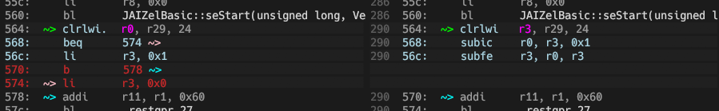

Try writing it with if/else instead, and it may match:

```cpp
    if (condition) {
        return TRUE;
    } else {
        return FALSE;
    }
```

The same applies in reverse. You'll likely have to swap if/else for a ternary at some point.

### Swapped registers

Sometimes, all of the instructions in a function will match, but which variable got put in which processor register by the compiler is all swapped around:

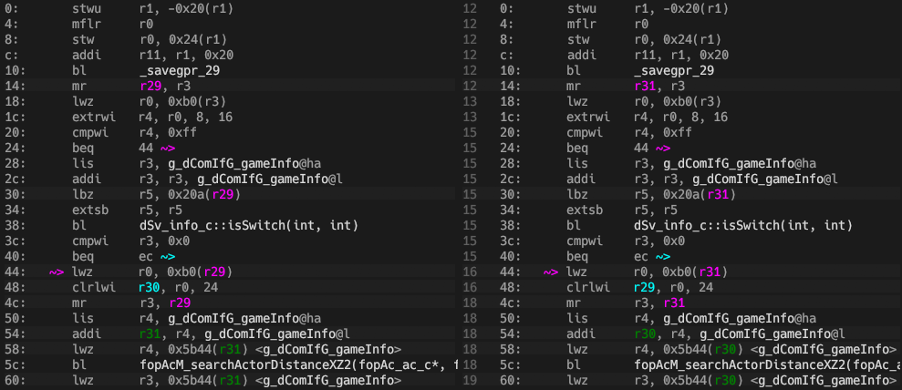

This issue is called a **regswap**, and it's so common, and has so many different possible causes, that it gets its [own entire guide](regalloc.md).

### Asking for help with a function by sharing a decomp.me scratch

If you're still stuck on some annoying minor issue, it can be worth having a second pair of eyes look to see if they can spot the issue. objdiff has a built-in way to easily share a particular function with others just by giving them a link on a site called decomp.me.

To use this feature, first open up the function you're stuck on in objdiff, and then click the `📲 decomp.me` button in the upper left corner:

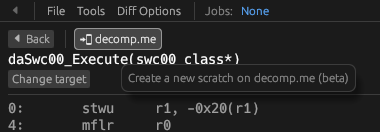

Your web browser will be opened automatically, and you should see a blank page that says "Move related code from Context tab to here".

Switch from the "Source code" tab to the "Context" tab. Search through this tab for the specific function you had opened up. Cut (don't copy) this entire function out of the Context tab and paste it into the Source code tab. You also might need to go back to the Context tab and delete all the code that comes *after* the function you just cut in order for it to compile properly (don't touch the context that comes before it though).

If done correctly, the scratch should compile and show the same issue as you were seeing in objdiff. Save (`Ctrl+S`) the scratch. Now you can share this scratch's URL in the [tww-decomp-help](https://discord.com/channels/688807550715560050/1150077114347966545) channel of the ZeldaRET Discord server and ask for help.

Note that scratches only show functions, not data. So if all the functions match 100% but some data doesn't, you'll have to figure that out locally using objdiff.

### Missing weak data

Many actors TUs in TWW have unused data included into them, usually in the .bss or .data sections. This data won't be referenced by any of the functions, but it's still necessary to include it in order for the TU to match.

You can tell if this is the case for the TU you're working on by looking at the symbol list in objdiff. If one of the data sections has a bunch of symbols on the left side but not on the right side, and they have names like `@1036`, they may be missing weak data.

The exact cause of these aren't fully understood yet, but we have headers you can include that should match these symbols. Copy either the .bss include or the .data include below, or both, depending on which section(s) in your TU the missing symbols are in:

```cpp
#include "weak_bss_936_to_1036.h" // IWYU pragma: keep
#include "weak_data_1811.h" // IWYU pragma: keep
```

### Diffing data values with objdiff

Sometimes, even if you've 100% matched all functions, some of the data symbols will show less than 100% in objdiff:

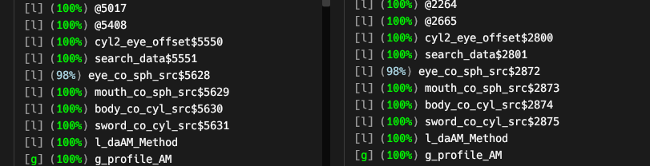

If the symbol in question has a name, like `eye_co_sph_src` in the above screenshot, you can find this variable by simply searching for its name in the .cpp and fixing whatever shows as different in objdiff's data diff view.

But what if the symbol doesn't have a real name, and it's just a bunch of numbers like `@1440`?

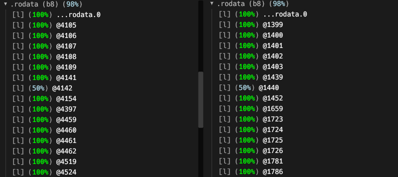

You won't find the text `@1440` anywhere in the .cpp file, because it's a compiler-generated name. The compiler automatically assigns these unique names to literal values that appear inside functions - most often float literals like `0.0f`. If one of these doesn't match, it means you got one of the literals in a function wrong.

objdiff has a feature that allows you to easily find exactly where this wrong literal appears. Go to Diff Options -> Function relocation diffs, and change this option from "Name or address (default)" to "Name or address, data value". Then scroll down through the list of functions that you had 100% matched, and you should now see that one of them shows less than 100%. That's the one that uses the incorrect literal.

If you open that function up in objdiff, you'll now see the literal with the wrong value is highlighted as a diff. You can hover over it on the left side to see what its value should really be:

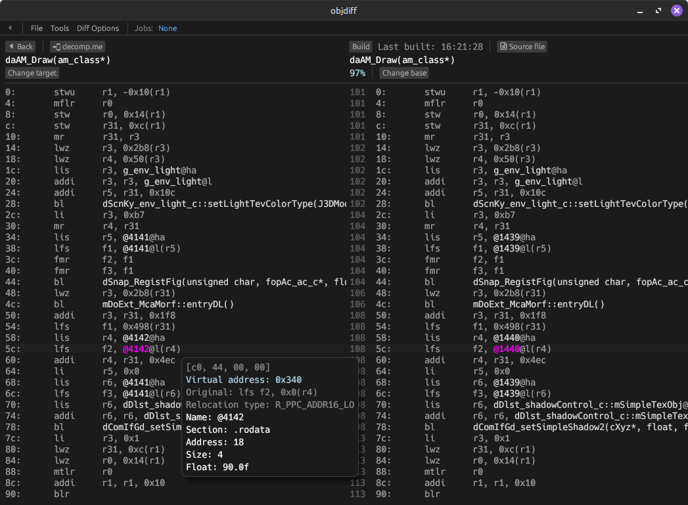

As objdiff shows you both the line number that the literal appears on (e.g. 108) and the value it should be changed to (e.g. 90.0f) it should be very easy to fix this.

Note that while unnamed data symbols are often floats literals, this isn't always the case. Sometimes they'll be PTMFs (Pointer to Member Functions) or switch statement jump tables. In these cases, objdiff's function diff view itself may not show you exactly what's wrong, and instead you'll have to look in the data diff view. You can hover over the highlighted hex bytes in this view to see relocations that don't match:

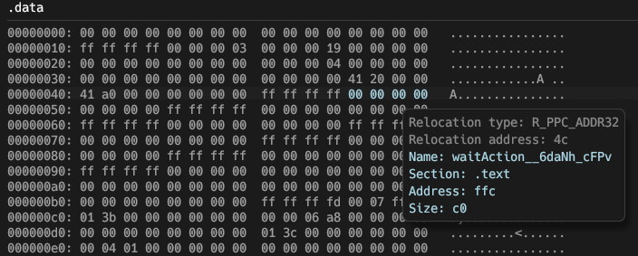

## Linking a 100% matching object

Once you've fully decompiled all functions and data so that every section shows as 100% matching in objdiff, it's time to check that the TU as a whole also matches. To do this, find the TU's name in [configure.py](../configure.py) and change it from `NonMatching` to `Matching` to tell the build system this TU should be linked, then run `ninja` (or `Ctrl+Shift+B` in VSCode) to build.

If you see `416 files OK` followed by a report of the project's total progress, that means your TU matches. Great, you're done! You can go ahead and submit a pull request on GitHub now.

But if you see something like this, where it says your chosen TU failed:
```
FAILED: build/GZLE01/ok 
build/tools/dtk shasum -q  -c config/GZLE01/build.sha1 -o build/GZLE01/ok
build/GZLE01/d_a_wall/d_a_wall.rel: FAILED
415 files OK
WARNING: 1 computed checksum(s) did NOT match
```
Then that means something in your TU doesn't actually match exactly and you should figure out what it is. We'll go over a few methods of finding out what the issue is - though keep in mind that you can still submit a pull request even if you don't manage to figure it out, just mention that in the description of the PR and revert it in [configure.py](../configure.py) to `NonMatching`.

### ninja diff (only for main.dol)

If the TU you're working on is in main.dol, you can run the `ninja diff` command and DTK will print out an explanation of exactly where the issue lies:

```
$ ninja diff
[4/4] DIFF build/GZLE01/framework.elf
FAILED: dol_diff 
build/tools/dtk -L error dol diff config/GZLE01/config.yml build/GZLE01/framework.elf
ERROR Expected to find symbol getZoneNo__20dStage_roomControl_cFi (type Function, size 0x1C) at 0x8005DCD0    
ERROR At 0x8005DCD0, found: offSwitch__10dSv_info_cFii (type Function, size 0x1AC)    
ERROR Instead, found getZoneNo__20dStage_roomControl_cFi (type Function, size 0x1C) at 0x8005EF6C    
ninja: build stopped: subcommand failed.
```

Unfortunately, this command currently only supports detecting differences in main.dol, while most actors are in RELs, so it won't print anything useful most of the time:

```
$ ninja diff
[3/3] DIFF build/GZLE01/framework.elf
```

If you're working on a REL, you'll have to locate the difference manually.

### Weak function ordering

Even if all functions match 100%, it's possible for the TU to not match if the compiler put some of the functions from included headers in the wrong order. You can tell if this is the case by looking at the list of functions in objdiff and slowly moving your mouse down across all the function names on the left hand side - if the cursor on the right hand side jumps back and forth at times, then the functions aren't in the same order.

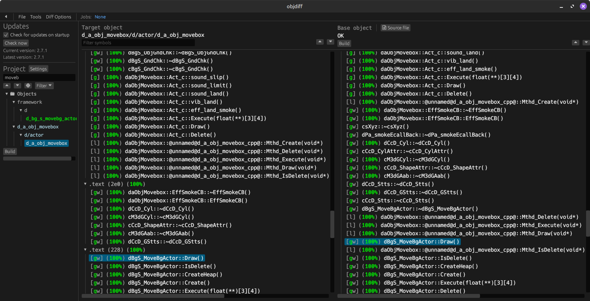

This issue is called **weak function ordering**, and it's so common, and has so many different possible causes, that it gets its [own entire guide](weak_func_order.md).

## Documentation and naming

Once an actor is fully decompiled, you can start naming some of its member variables if you want to. This is completely optional - it's normal to submit a PR without documenting most fields. Leaving them unnamed (e.g. `field_0x290`) is preferable to coming up with wrong names if you aren't sure.

But if you do decide to start naming things, you should check out the [coding guidelines page](coding_guidelines.md).
